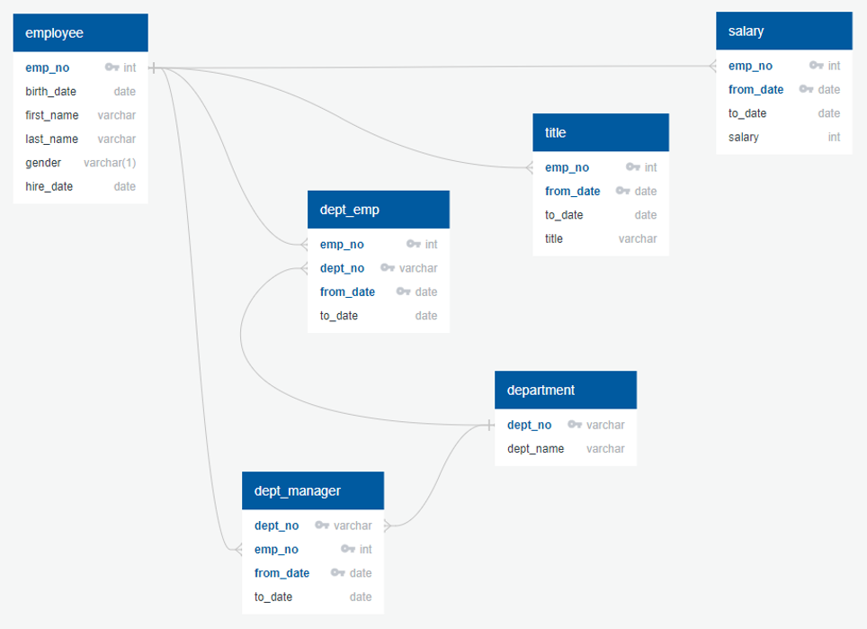
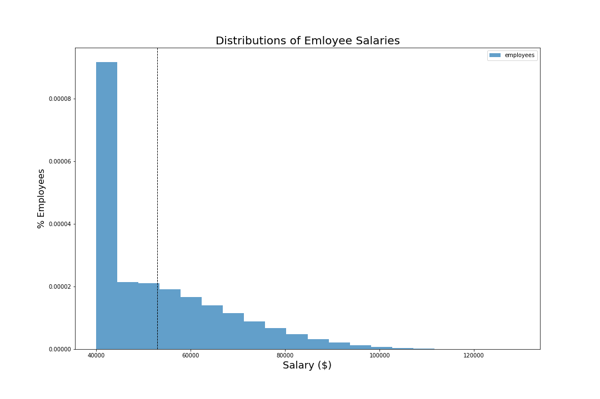
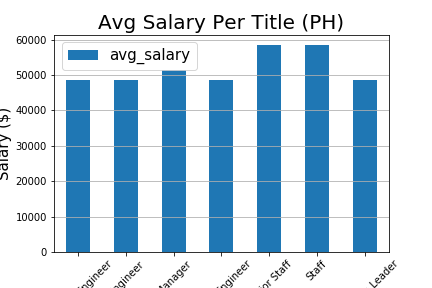

# sql-challenge
## by Michael Dowlin
### 12/6/19

#### Description
This project imports the Pewlett Hackard employee data into a PostGreSQL database.  I used the quickdatabasediagrams.com modeling
  tool to generate the data definition language (ddl) that creates the tables and constraints.  I did a non-required sql file called
  "data_analysis.sql" to check out the data after importing it.  Some of the results in there, like seeing if anyone has more than
  one salary, are used to formulate the homework queries found in the "quries.sql" file.  The ERD image, linked to this readme, is
  located in the images folder.

#### Contents

| File                | Location            | Description                                                                       |
|---------------------|---------------------|-----------------------------------------------------------------------------------|
|[data_analysis.sql](EmployeeSQL/data_analysis.sql)    |\EmployeeSQL         |Adhoc anlaysis, not part of assingment                           |
|[employee_db_ddl.sql](EmployeeSQL/employee_db_ddl.sql)  |\EmployeeSQL         |Script to create tables, or data definition language              |
|[employee_erd.png](EmployeeSQL/images/employee_erd.png)     |\EmployeeSQL\images  |ERD, created by using quickdatabasediagrams.com                  |                
|[queries.sql](EmployeeSQL/queries.sql)          |\EmployeeSQL         |Homework queries                                                  |

#### Database Model

*Pewlett Hackard Employee DB ERD*

#### Bonus Charts
- Chart 1

*Distribution of All Employee Salaries*

- Chart 2

*Average Salary by Title Bar Chart*

