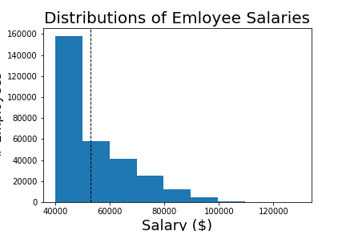

# sql-challenge
## by Michael Dowlin
### 12/6/19

#### Description
This project imports the Pewlett Hackard employee data into a PostGreSQL database.  I used the quickdatabasediagrams.com modeling
  tool to generate the data definition language (ddl) that creates the tables and constraints.  I did a non-required sql file called
  "data_analysis.sql" to check out the data after importing it.  Some of the results in there, like seeing if anyone has more than
  one salary, are used to formulate the homework queries found in the "quries.sql" file.  The ERD image, linked to this readme, is
  located in the images folder.

#### Contents

| File                | Location            | Description                                                                       |
|---------------------|---------------------|-----------------------------------------------------------------------------------|
|[avg_salary_by_title](EmployeeSQL/images/avg_salary_by_title.png)    |\EmployeeSQL\images     |Chart for average salary by title       |
|[bonus_notebook.ipynb](EmployeeSQL/bonus_notebook.ipynb)   |\EmployeeSQL     |Bonus Jupyter Notebook                                 |
|[data_analysis.sql](EmployeeSQL/data_analysis.sql)    |\EmployeeSQL         |Adhoc anlaysis, not part of assignment                           |
|[dist_salary.png](EmployeeSQL/images/dist_salary.png)    |\EmployeeSQL\images    |Chart for distribution of all employee salaries        |
|[employee_db_ddl.sql](EmployeeSQL/employee_db_ddl.sql)  |\EmployeeSQL         |Script to create tables, or data definition language              |
|[employee_erd.png](EmployeeSQL/images/employee_erd.png)     |\EmployeeSQL\images  |ERD, created by using quickdatabasediagrams.com                  |                
|[queries.sql](EmployeeSQL/queries.sql)          |\EmployeeSQL         |Homework queries                                                  |

#### Database Model
Note that for the diagram I keep all of the composite primary keys together.  I think it looks cleaner for the ERD.  I modified the DDL so that the columns are in the same order as the csv files, due to laziness.

*Pewlett Hackard Employee DB ERD*

#### Bonus Charts
- Chart 1

*Distribution of All Employee Salaries*

- Chart 2

*Average Salary by Title Bar Chart*

